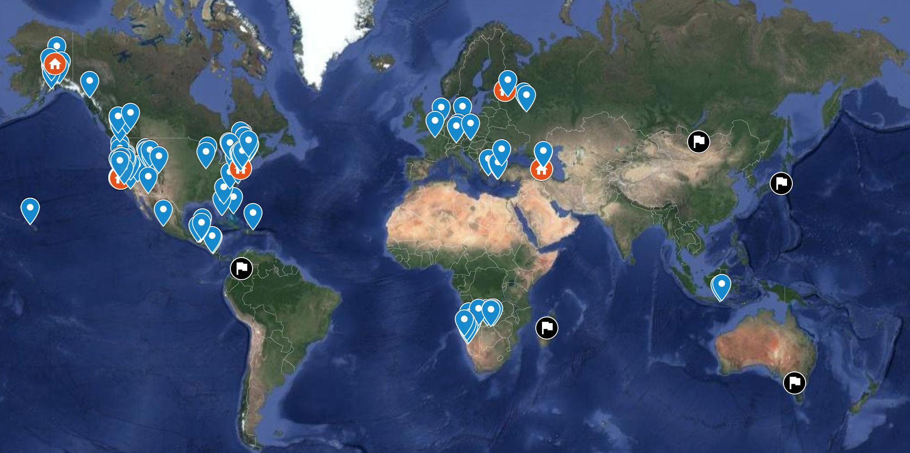

Hi! I'm a roboticist living in San Francisco. 
I lead the autonomous technology group at [Skydio](https://www.skydio.com/), where we build advanced autonomous drones based on computer vision. I was born in Armenia and grew up in Alaska before studying at Princeton and then moving west to get my Master’s in robotics from Stanford.

My work focuses on robust approaches to computer vision, deep learning, nonlinear optimization, motion planning, and dynamics. I also have a keen interest in systems architecture and symbolic computation.

In my free time I enjoy making music with guitars and drums, traveling, playing [bughouse](https://en.wikipedia.org/wiki/Bughouse_chess), and flying things.

You can reach me via <a href="mailto:hayk.mart@gmail.com">email</a>.

## Events

2019.05 : Cheers to [Greg Kahn](https://people.eecs.berkeley.edu/~gregoryk/) for a great research internship here!  
2019.04 : Skydio autonomy invited to workshops @ ICRA ([1](https://uav-learning-icra.github.io/2019/), [2](https://www.aerial-robotics-workshop.com/agenda.html)), [RSS](https://sites.google.com/view/rss19safe), and [CVPR](https://embeddedvisionworkshop.wordpress.com/)  
2018.10 : R1 lands in [Apple](https://www.apple.com/us_edu_5005057/shop/product/HMLV2LL/A/skydio-r1-drone) retail stores and [Amazon](https://www.amazon.com/Skydio-Self-Flying-Camera-Smart-Drone/dp/B07HRPQNLW/)!  
2018.09 : Skydio [announces](https://spectrum.ieee.org/automaton/robotics/drones/skydio-announces-sdk-to-make-worlds-cleverest-drone-even-cleverer) [SDK](https://www.skydio.com/developer/) to build apps for flying cameras  
2018.08 : [LentinkLab](http://lentinklab.stanford.edu/) + [BDML](http://bdml.stanford.edu/) + Skydio awared [DESI](https://dod.defense.gov/News/Article/Article/1595382/dod-announces-desi-awards-for-university-industry-collaborations/) basic research grant  
2018.08 : We had a fantastic set of seven interns on the autonomy team this  &nbsp;&nbsp;&nbsp;&nbsp;&nbsp;&nbsp;&nbsp;&nbsp;&nbsp; summer. I worked most closely with the talented [Somil Bansal](http://people.eecs.berkeley.edu/~somil/).  
2018.02 : Skydio R1 [launches](https://spectrum.ieee.org/automaton/robotics/drones/skydio-r1-drone) as the first fully autonomous drone!  
2017.07 : [End-to-End Geometry and Context for Deep Stereo Regression](https://arxiv.org/abs/1703.04309) is a &nbsp;&nbsp;&nbsp;&nbsp;&nbsp;&nbsp;&nbsp;&nbsp;&nbsp; Spotlight Oral @ [ICCV](http://iccv2017.thecvf.com/)! Thanks to [Alex Kendall](https://alexgkendall.com/) for his awesome work.
2015.03 : Stanford -> Skydio

## Talks

2019.06 : [Embedded Vision Workshop](https://embeddedvisionworkshop.wordpress.com/) @ CVPR 2019  
2019.03 : SF [Robotics Showcase](https://www.robotics-showcase.com/skydio) @ Bloomberg  
2018.12 : Guest Lecture, [16.S398](https://docs.google.com/document/d/1nEcBizxL6BF5rj_a9xub9De9HRXUSizMbnTuPBAgNGk/export?format=pdf) - Visual Navigation ([Luca Carlone](https://lucacarlone.mit.edu/)) @ MIT  
2018.11 : Guest Lecture, AA 248E - Aerial Robotics ([David Lentink](http://lentinklab.stanford.edu/)) @ Stanford  
2018.08 : Guest Lecture, AE 483 - Navigation and Control ([Grace Gao](http://gracegao.ae.illinois.edu/)) @ UIUC  
2018.03 : AI Workshop @ [NYCDFF](https://www.nycdronefilmfestival.com/)  
2018.03 : ZEDtalk @ [Zoox](https://zoox.com/)  
2018.03 : Speaker @ Society of Artificers  
2017.12 : Tech Talk, [SUAVE](http://stanforduav.org/) @ Stanford  
2017.11 : GRASP Special Seminar @ UPenn  
2017.11 : Robotics Seminar @ Princeton  
2017.06 : Skydio Research Deep Dive @ CVPR 2017  

## Places
I am a fan of travel and time in hostels. Below are the places I've lived in red, visited in blue, and my top wishlist in black.

  <hidden>
    
    
  </hidden>
  <zoom-image src='world-map.png' zoomSrc='world-map.png' alt='Plugin Screenshot'></zoom-image>

